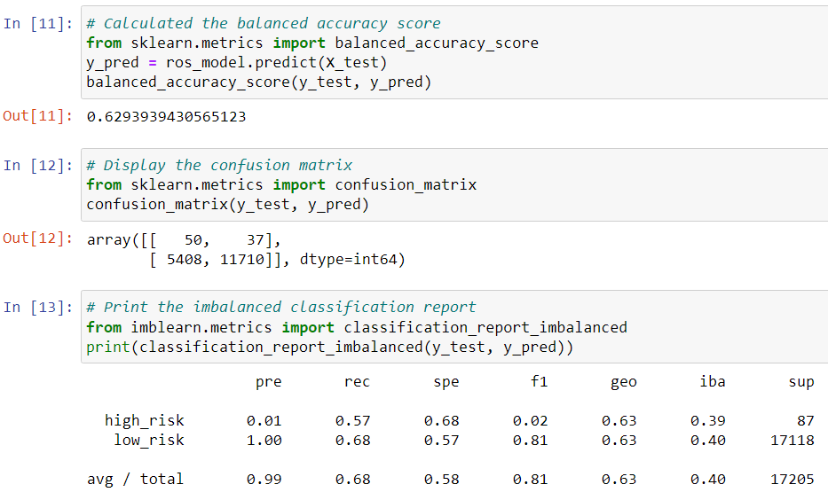
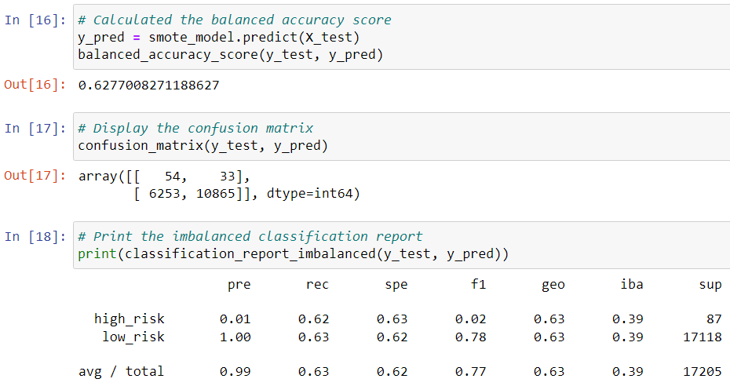
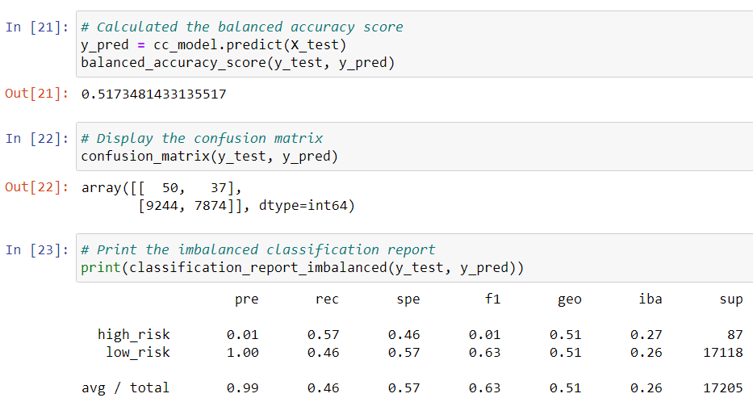
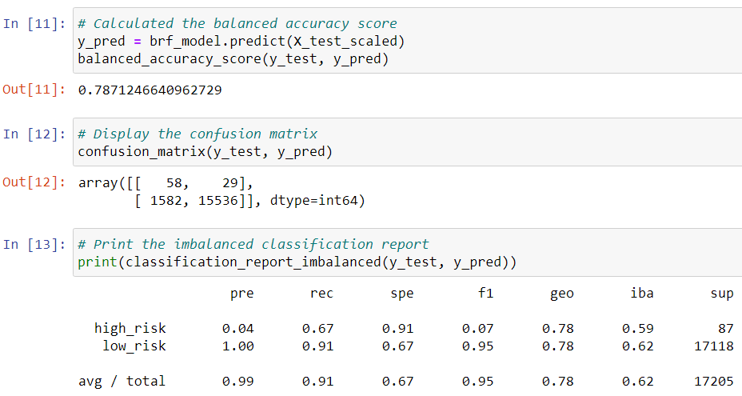
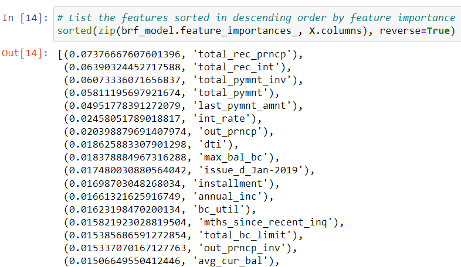
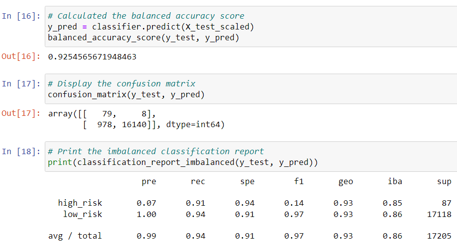

# Credit Risk Analysis
 
## Overview

The purpose of this analysis is to train various machine learning models with a LendingClub credit card dataset to predict credit risk, and then assess each model's performance. We use various resampling and learning methods including oversampling, undersampling, combining over- and under-sampling, and reducing bias with random forests and ensemble learning. The algorithms and models used are RandomOverSampler, SMOTE, ClusterCentroids, SMOTEENN, BalancedRandomForestClassifier, and EasyEnsembleClassifier.

## Results

* Resampling the data with the RandomOverSampler produced an accuracy score of about 0.63. Although the total precision was 0.99, the precision for low risk loans was 1.00, while the precision for high risk loans was only 0.01. This indicates that all of the loans predicted as low risk were actually low risk, but a very small amount of loans predicted as high risk were actually high risk. The total recall of this model was 0.68, with the recall for low risk loans also being 0.68, the highest of all the resampling algorithms. This means RandomOverSampler performed relatively well at correctly classifying the low risk algorithms.

* Using SMOTE oversampling gives us overall similar results as RandomOverSampler: the accuracy is about 0.63, the overall precision is 0.99 (0.01 for high risk loans and 1.00 for low risk loans), and the recall is 0.63.

* Using the Cluster Centroids algorithm to undersample the data produces unfavorable results compared to the previous two algorithms. The accuracy score is lower at about 0.52, and the overall recall was significantly lower at only 0.46, indicating that the majority of low risk loans were classified as high risk and vice versa. The precision was the same as the previous algorithms.

* Using SMOTEENN to combine over- and under-sampling produced the best results of all of the resampling algorithms. The accuracy score was the highest at about 0.65, with the total recall being slightly lower than RandomOverSampler and SMOTE at 0.61. Interestingly, the recall for high risk loans was 0.70, meaning that SMOTEENN performed better than the other resampling algorithms at correctly classifying high risk loans as high risk. The precision was once again 0.01 for high risk loans and 1.00 for low risk loans.

* Our first machine learning algorithm was Balanced Random Forest Classifier, and it performed better than any of the resampling algorithms. The accuracy score was 0.79, the recall was 0.91, and although the precision was still 0.99, there was a slightly higher precision for high risk loans at 0.04. According to the model, the most important features for predicting credit risk were total principal, total interest, and total payments.

* Easy Ensemble AdaBoost Classifier gave the best results of any of the algorithms. The accuracy score was about 0.93, the recall was 0.94, and the precision for high risk loans was the best of all the algorithms at 0.07.

## Summary

Overall, the resampling algorithms gave unsatisfactory results, and the machine learning algorithms performed much better at predicting both low risk and high risk loans. My recommendation would be to use the Easy Ensemble Classifier, as it gave near-perfect accuracy and recall. There is a downside, however, in that if the algorithm predicts someone to have a high risk loan, there is still only a 7 percent chance that the loan is actually high risk. This may mean that there is not enough justification to use this algorithm if the goal is only to predict high risk loans.